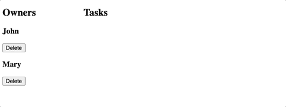

# Ajax and apis: Assignment

## Instructions

1. Fork and clone this repository
2. Change into the cloned directory
3. Create and checkout a new branch named `assignment`
4. Follow the instructions provided in the task.js file and look at expected result 
5. When you are done, commit, push to your fork and submit a pull request
